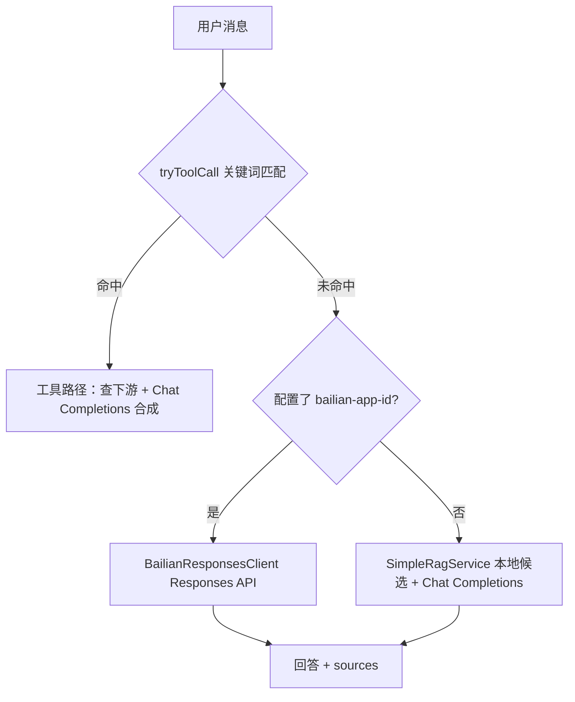

# 当前 AI 助手回答逻辑（与「能否读全量」说明）

本文与 `AiChatServiceImpl`、`SimpleRagService`、`UserTools` 实现保持一致，说明分流、RAG、工具与数据范围。

## 整体流程（两条主路径）

### 1) 工具路径（`tryToolCall`）

根据**固定中文关键词**触发，例如：

- 「我的优惠券 / 可用券 / 优惠券有哪些」→ `UserTools.queryMyCoupons`（`GET promotion-service /coupons/my`）
- 「我的地址 / 收货地址」→ `queryMyAddresses`（`GET user-service /addresses`，脱敏）
- 「我的信息 / 我是谁 / 我的账号」→ `queryMe`（`GET /users/me`，少量字段）
- 「订单 + 状态/查询/进度」且消息中正则匹配到**订单号** → `queryOrderById`

命中工具路径时：返回结构化 `sources`；若已配置 `HM_AI_LLM_API_KEY`，会**先工具后 LLM**，用查询结果合成自然语言回答；未配置或调用失败则使用预设短文案。SSE 分支发 `result` 事件。

### 2) 通用导购路径

#### A. 百炼内置 RAG（推荐，需控制台配置）

若设置 **`hm.ai.llm.bailian-app-id`**（环境变量 **`HM_AI_BAILIAN_APP_ID`**）：

- 在 [百炼应用中心](https://bailian.console.aliyun.com/) 创建**智能体**（或工作流），在应用内**绑定知识库**并发布。仓库内预置可导入的 Markdown 见目录 **`ai-assistant-service/knowledge-base/`**（含导入说明 `README.md`）。
- 本服务通过 **`BailianResponsesClient`** 调用官方 **Responses API**：`POST .../api/v2/apps/agent/{APP_ID}/compatible-mode/v1/responses`，将用户问题发给该应用；**检索与拼接在百炼侧完成**。
- 返回的 `sources` 中会带一条 `type=bailian_app` 的说明（非逐条检索片段，具体引用格式以控制台应用为准）。
- 若调用失败或返回空文本，会**自动回退**到下方本地 RAG。

#### B. 本地 RAG + Chat Completions（未配置应用 ID 或回退时）

- **商品（优先 ES）**：`SimpleRagService` 先做 **`ShoppingIntentParser` 规则解析**（预算区间→`minPrice`/`maxPrice` 分、常见品牌→`brand`、套话压缩 `key`），再与可选的 **LLM 意图抽取**（**`hm.ai.rag.llm-intent-enabled=true`** 且已配置 **`hm.ai.llm.api-key`**）合并：模型输出 `searchKey`/`category`/`brand`/`color`/`size` 等 JSON，经 **`ShoppingIntentMergeService`** 写入最终检索参数（**正则解出的价格带优先于 LLM**；**LLM 的 `category` 只并入 `key`，不直接作 ES `category` term**，避免与索引类目值不一致）。请求 **`GET /search/list`**（与 [`SearchController`](d:/1study/study/java/program/hmall/item-service/src/main/java/com/hmall/item/controller/SearchController.java) 一致）时可带 **`specColor`/`specSize`**（与 ES 字段对应）。默认 Top-K（**`hm.ai.rag.search-top-k`**），prompt 内再按 **`hm.ai.rag.prompt-max-items`** 截断。LLM 抽取失败或未启用时**仅用规则**，不阻断流程。若 ES 无结果或调用失败，回退 **`GET /items/page`** 分页 + 关键词过滤。
- **公开券**：`GET /coupons`，最多 **`hm.ai.rag.public-coupon-max`** 条写入 prompt。
- **本地知识库（独立 ES 向量索引）**：`knowledge-base/*.md` 构建时打进 classpath；启动时创建索引 **`hm.ai.knowledge.es-index`（默认 `ai_kb_chunks`）**，与用户 **商品 ES 索引隔离**。对用户问题调用 **`hm.ai.embedding.*`**（OpenAI 兼容 **`/v1/embeddings`**）得到向量，在 ES 7.12 上用 **`script_score` + `cosineSimilarity`** 取 Top-K 片段，写入 prompt 的 **【知识库向量检索】**；`sources` 中含 **`type=kb_chunk`**。若 **`hm.ai.knowledge.enabled=false`** 或 ES/Embedding 不可用，该段为空或仅打 WARN，不阻断商品/券 RAG。可通过 **`POST /ai/admin/reindex-kb`**（可选头 **`X-Admin-Token`**）全量重建索引；若 **`hm.ai.knowledge.auto-reindex-if-empty`** 为 true 且索引文档数为 0，启动后会异步执行一次全量导入。
- 拼 prompt 后调用 **`LlmClient.chat`**（OpenAI 兼容 `/v1/chat/completions`，与 `hm.ai.llm.base-url` 一致）。

**注意**：用户私有「我的优惠券」「地址」仍仅在工具关键词命中时查询；工具合成**始终**走 Chat Completions，不会走百炼应用 Responses，以免干扰结构化 JSON 提示。

#### C. 百炼智能体侧「商品工具」（与本地 ES 一致）

若通用问答走百炼、且希望**推荐落在真实 SKU**，请在百炼应用控制台为智能体配置 **HTTP 工具**（具体名称以控制台为准），请求示例：

- **方法**：`GET`
- **URL**（经网关示例）：`http://<gateway-host>:8080/search/list`
- **Query**（与 `ItemPageQuery` 一致，可按用户填槽传入）：`pageNo=1`、`pageSize=20`、`key=`、`brand=`、`category=`、`minPrice=`、`maxPrice=`（单位：**分**）、`specColor=`、`specSize=`、`status=1`
- **鉴权**：若网关对 `/search/**` 免 JWT（见网关配置），可直接调；否则需带与前端一致的 `Authorization`。

将工具返回的 `list`（商品 JSON）作为模型生成回答的依据，可避免「搜不到却瞎编」。
---

## 「能否读完所有商品、优惠券、地址」？

| 数据 | 是否「全量」进入模型上下文 | 说明 |
|------|---------------------------|------|
| 商品 | **否** | 优先 ES `search-top-k` 召回，进 prompt 再截断 `prompt-max-items`；回退分页有上限 |
| 公开进行中券 | **否** | 仅 `GET /coupons` 摘要前 N 条 |
| 知识库 FAQ（本地 ES） | **否** | `hm.ai.knowledge.search-top-k` 召回 + `max-prompt-chars` 截断 |
| 我的优惠券 | **仅关键词触发** | `/coupons/my`；工具路径可走 LLM 合成 |
| 地址 | **仅关键词触发** | 脱敏后字段有限 |

技术上可继续扩展分页或检索，但不建议把全库一次性塞进单次 prompt（token、成本、延迟、隐私）。

---

## 配置项（节选）

| 变量 / 配置 | 含义 |
|-------------|------|
| `HM_AI_ITEM_BASE_URL` / `hm.ai.rag.item-base-url` | 商品服务基址（同时用于 `/search/list` 与 `/items/page`） |
| `HM_AI_RAG_LLM_INTENT_ENABLED` / `hm.ai.rag.llm-intent-enabled` | 是否在 ES 检索前用 LLM 抽取意图并与规则合并，默认 `false`；需同时配置有效 **`hm.ai.llm.api-key`** |
| `HM_AI_RAG_USE_ES` / `hm.ai.rag.use-elasticsearch` | 是否优先走 ES，默认 `true` |
| `HM_AI_RAG_SEARCH_TOP_K` / `hm.ai.rag.search-top-k` | `/search/list` 每页召回条数上限 |
| `HM_AI_RAG_PROMPT_MAX_ITEMS` / `hm.ai.rag.prompt-max-items` | 写入 prompt 的商品条数上限 |
| `HM_AI_PROMOTION_BASE_URL` / `hm.ai.rag.promotion-base-url` | 促销服务基址（公开券列表） |
| `hm.ai.rag.item-max-pages` | RAG 拉商品页数上限 |
| `hm.ai.rag.public-coupon-max` | 公开券写入 prompt 的最大条数 |
| `HM_AI_LLM_*` | 大模型 OpenAI 兼容接口（`base-url` 一般为 `https://dashscope.aliyuncs.com/compatible-mode/v1`） |
| `HM_AI_BAILIAN_APP_ID` / `hm.ai.llm.bailian-app-id` | 百炼应用 ID；非空则通用导购走 Responses API |
| `HM_AI_BAILIAN_ENDPOINT_BASE` | 可选，默认 `https://dashscope.aliyuncs.com`（国际地域可换） |
| `HM_AI_KNOWLEDGE_*` / `hm.ai.knowledge.*` | 向量知识库：开关、**ES 地址/端口/索引名**、Top-K、自动空库导入、`admin-token` |
| `HM_AI_EMBEDDING_*` / `hm.ai.embedding.*` | Embeddings：`base-url`（如百炼 `.../compatible-mode`）、`model`、`dims`（须与索引一致）、`api-key`（可空则回退 LLM key） |
