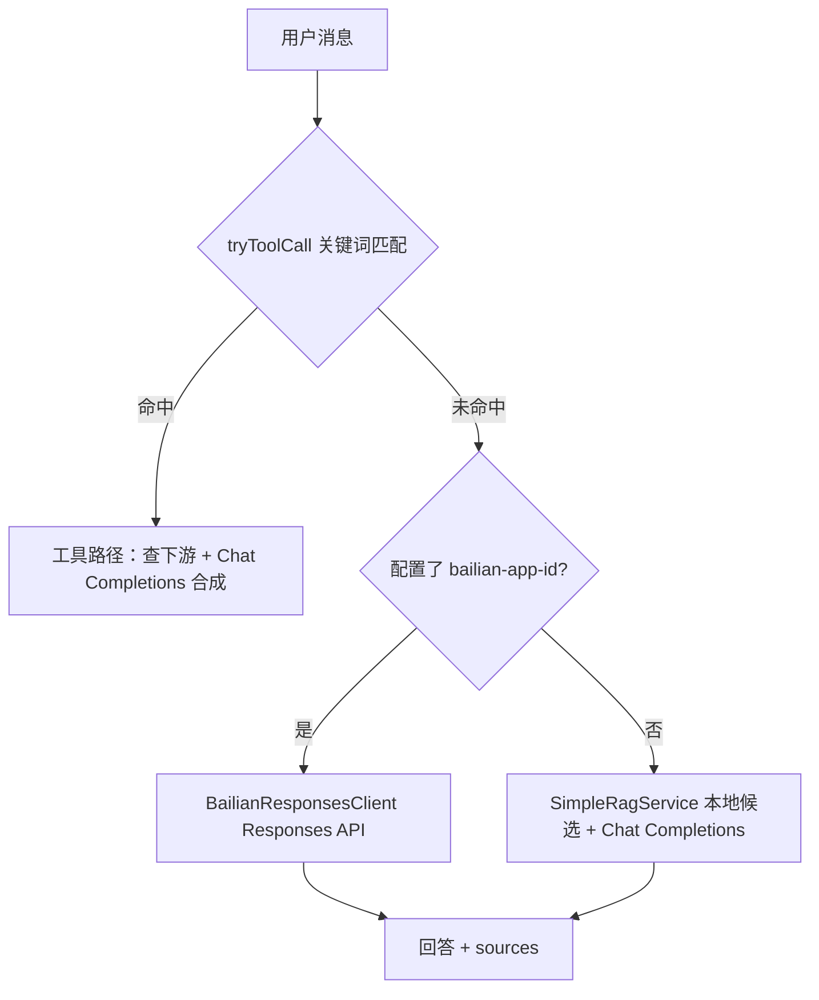

# 当前 AI 助手回答逻辑（与「能否读全量」说明）

本文与 `AiChatServiceImpl`、`SimpleRagService`、`UserTools` 实现保持一致，说明分流、RAG、工具与数据范围。

## 整体流程（两条主路径）

### 1) 工具路径（`tryToolCall`）

根据**固定中文关键词**触发，例如：

- 「我的优惠券 / 可用券 / 优惠券有哪些」→ `UserTools.queryMyCoupons`（`GET promotion-service /coupons/my`）
- 「我的地址 / 收货地址」→ `queryMyAddresses`（`GET user-service /addresses`，脱敏）
- 「我的信息 / 我是谁 / 我的账号」→ `queryMe`（`GET /users/me`，少量字段）
- 「订单 + 状态/查询/进度」且消息中正则匹配到**订单号** → `queryOrderById`

命中工具路径时：返回结构化 `sources`；若已配置 `HM_AI_LLM_API_KEY`，会**先工具后 LLM**，用查询结果合成自然语言回答；未配置或调用失败则使用预设短文案。SSE 分支发 `result` 事件。

### 2) 通用导购路径

#### A. 百炼内置 RAG（推荐，需控制台配置）

若设置 **`hm.ai.llm.bailian-app-id`**（环境变量 **`HM_AI_BAILIAN_APP_ID`**）：

- 在 [百炼应用中心](https://bailian.console.aliyun.com/) 创建**智能体**（或工作流），在应用内**绑定知识库**并发布。
- 本服务通过 **`BailianResponsesClient`** 调用官方 **Responses API**：`POST .../api/v2/apps/agent/{APP_ID}/compatible-mode/v1/responses`，将用户问题发给该应用；**检索与拼接在百炼侧完成**。
- 返回的 `sources` 中会带一条 `type=bailian_app` 的说明（非逐条检索片段，具体引用格式以控制台应用为准）。
- 若调用失败或返回空文本，会**自动回退**到下方本地 RAG。

#### B. 本地 RAG + Chat Completions（未配置应用 ID 或回退时）

- **商品**：对 `item-service` 调用 `GET /items/page`，按 **`hm.ai.rag.item-max-pages`**（默认 2）分页拉取，关键词过滤；若无命中则用**前 8 条**兜底。
- **公开券**：`GET /coupons`，最多 **`hm.ai.rag.public-coupon-max`** 条写入 prompt。
- 拼 prompt 后调用 **`LlmClient.chat`**（OpenAI 兼容 `/v1/chat/completions`，与 `hm.ai.llm.base-url` 一致）。

**注意**：用户私有「我的优惠券」「地址」仍仅在工具关键词命中时查询；工具合成**始终**走 Chat Completions，不会走百炼应用 Responses，以免干扰结构化 JSON 提示。

---

## 「能否读完所有商品、优惠券、地址」？

| 数据 | 是否「全量」进入模型上下文 | 说明 |
|------|---------------------------|------|
| 商品 | **否** | 多页分页有上限；再筛最多 8 条进 prompt |
| 公开进行中券 | **否** | 仅 `GET /coupons` 摘要前 N 条 |
| 我的优惠券 | **仅关键词触发** | `/coupons/my`；工具路径可走 LLM 合成 |
| 地址 | **仅关键词触发** | 脱敏后字段有限 |

技术上可继续扩展分页或检索，但不建议把全库一次性塞进单次 prompt（token、成本、延迟、隐私）。

---

## 配置项（节选）

| 变量 / 配置 | 含义 |
|-------------|------|
| `HM_AI_ITEM_BASE_URL` / `hm.ai.rag.item-base-url` | 商品服务基址 |
| `HM_AI_PROMOTION_BASE_URL` / `hm.ai.rag.promotion-base-url` | 促销服务基址（公开券列表） |
| `hm.ai.rag.item-max-pages` | RAG 拉商品页数上限 |
| `hm.ai.rag.public-coupon-max` | 公开券写入 prompt 的最大条数 |
| `HM_AI_LLM_*` | 大模型 OpenAI 兼容接口（`base-url` 一般为 `https://dashscope.aliyuncs.com/compatible-mode/v1`） |
| `HM_AI_BAILIAN_APP_ID` / `hm.ai.llm.bailian-app-id` | 百炼应用 ID；非空则通用导购走 Responses API |
| `HM_AI_BAILIAN_ENDPOINT_BASE` | 可选，默认 `https://dashscope.aliyuncs.com`（国际地域可换） |
